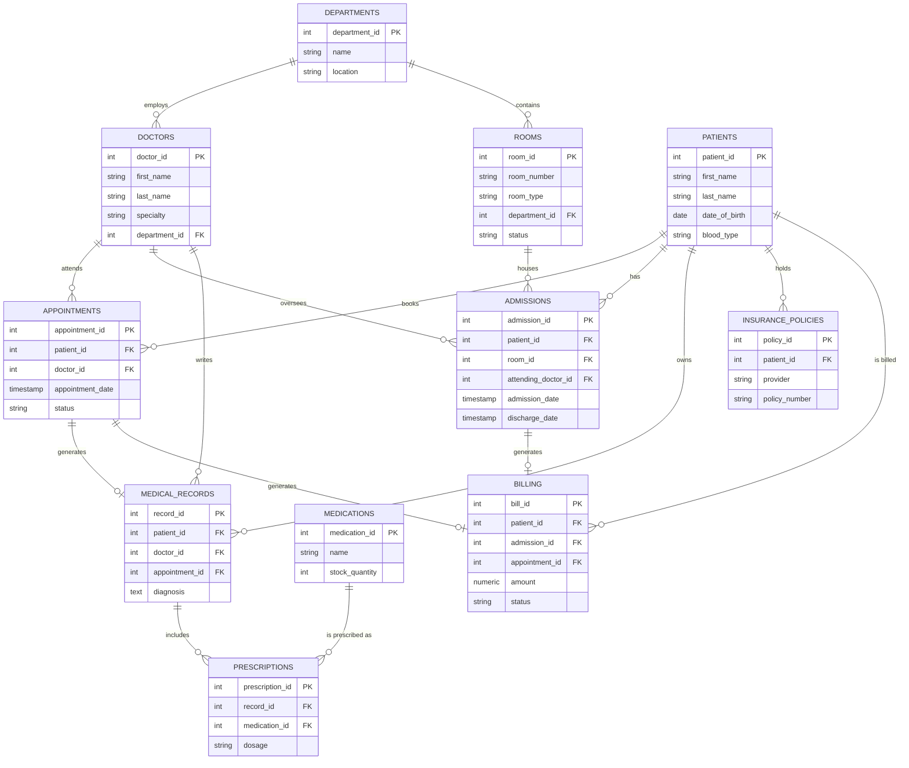

# Entity-Relationship Diagram

GitHub renders Mermaid diagrams natively — this shows up as a real diagram
directly on the repo page, no image export needed.

```mermaid
erDiagram
    DEPARTMENTS ||--o{ DOCTORS : employs
    DEPARTMENTS ||--o{ ROOMS : contains
    PATIENTS ||--o{ APPOINTMENTS : books
    DOCTORS ||--o{ APPOINTMENTS : attends
    PATIENTS ||--o{ ADMISSIONS : has
    ROOMS ||--o{ ADMISSIONS : houses
    DOCTORS ||--o{ ADMISSIONS : oversees
    PATIENTS ||--o{ MEDICAL_RECORDS : owns
    DOCTORS ||--o{ MEDICAL_RECORDS : writes
    APPOINTMENTS ||--o| MEDICAL_RECORDS : generates
    MEDICAL_RECORDS ||--o{ PRESCRIPTIONS : includes
    MEDICATIONS ||--o{ PRESCRIPTIONS : "is prescribed as"
    PATIENTS ||--o{ INSURANCE_POLICIES : holds
    PATIENTS ||--o{ BILLING : "is billed"
    ADMISSIONS ||--o| BILLING : generates
    APPOINTMENTS ||--o| BILLING : generates

    DEPARTMENTS {
        int department_id PK
        string name
        string location
    }
    DOCTORS {
        int doctor_id PK
        string first_name
        string last_name
        string specialty
        int department_id FK
    }
    ROOMS {
        int room_id PK
        string room_number
        string room_type
        int department_id FK
        string status
    }
    PATIENTS {
        int patient_id PK
        string first_name
        string last_name
        date date_of_birth
        string blood_type
    }
    APPOINTMENTS {
        int appointment_id PK
        int patient_id FK
        int doctor_id FK
        timestamp appointment_date
        string status
    }
    ADMISSIONS {
        int admission_id PK
        int patient_id FK
        int room_id FK
        int attending_doctor_id FK
        timestamp admission_date
        timestamp discharge_date
    }
    MEDICAL_RECORDS {
        int record_id PK
        int patient_id FK
        int doctor_id FK
        int appointment_id FK
        text diagnosis
    }
    MEDICATIONS {
        int medication_id PK
        string name
        int stock_quantity
    }
    PRESCRIPTIONS {
        int prescription_id PK
        int record_id FK
        int medication_id FK
        string dosage
    }
    INSURANCE_POLICIES {
        int policy_id PK
        int patient_id FK
        string provider
        string policy_number
    }
    BILLING {
        int bill_id PK
        int patient_id FK
        int admission_id FK
        int appointment_id FK
        numeric amount
        string status
    }
```
